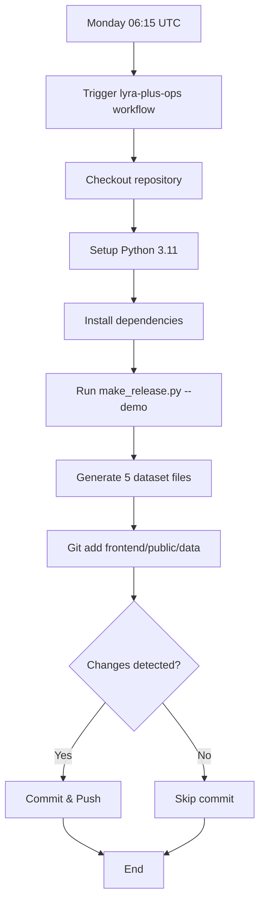

# Lyra+ Ops Implementation Summary

This document provides a quick overview of the Lyra+ Ops observability system implementation.

## 🎯 Objectives Achieved

✅ **Weekly Automated Data Refresh** - GitHub Actions workflow runs every Monday at 06:15 UTC
✅ **Health API Endpoint** - RESTful endpoint for monitoring data availability
✅ **Health Dashboard** - User-friendly web interface for observability
✅ **Dataset Generation** - Automated script with demo and production modes
✅ **Comprehensive Documentation** - Complete guide with examples and troubleshooting

## 📁 File Structure

```
zlecaf-project-/
├── .github/
│   └── workflows/
│       └── lyra_plus_ops.yml          ← Weekly cron workflow
├── backend/
│   ├── make_release.py                ← Dataset generation script (NEW)
│   ├── server.py                      ← Added /api/health endpoint
│   └── requirements.txt               ← Added openpyxl
├── frontend/
│   ├── public/
│   │   └── data/                      ← Generated datasets directory
│   │       ├── .gitkeep
│   │       ├── zlecaf_tariff_lines_by_country.json
│   │       ├── zlecaf_africa_vs_world_tariffs.xlsx
│   │       ├── zlecaf_rules_of_origin.json
│   │       ├── zlecaf_dismantling_schedule.csv
│   │       └── zlecaf_tariff_origin_phase.json
│   └── src/
│       ├── App.js                     ← Added /health route
│       └── components/
│           └── Health.js              ← Health dashboard component (NEW)
└── docs/
    ├── LYRA_OPS.md                    ← Complete documentation (NEW)
    └── IMPLEMENTATION_SUMMARY.md      ← This file (NEW)
```

## 🔄 Workflow Flow



## 🌐 API Endpoints

### Health Check
**GET** `/api/health`

**Response (200 OK):**
```json
{
  "ok": true,
  "files": {
    "zlecaf_tariff_lines_by_country.json": true,
    "zlecaf_africa_vs_world_tariffs.xlsx": true,
    "zlecaf_rules_of_origin.json": true,
    "zlecaf_dismantling_schedule.csv": true,
    "zlecaf_tariff_origin_phase.json": true
  },
  "lastUpdated": "2024-10-08T15:12:54.836155"
}
```

**Response (503 Service Unavailable):**
```json
{
  "ok": false,
  "files": {
    "zlecaf_tariff_lines_by_country.json": false,
    "zlecaf_africa_vs_world_tariffs.xlsx": false,
    ...
  }
}
```

## 🎨 Frontend Dashboard

**Route:** `/health`

**Features:**
- Visual status indicator (Green for OK, Red for DEGRADED)
- File-by-file availability check with icons
- Last updated timestamp
- Responsive design with Tailwind CSS
- Real-time data fetching via React hooks

## 🧪 Testing

### Local Testing

1. **Generate datasets:**
   ```bash
   python backend/make_release.py --demo
   ```

2. **Start backend:**
   ```bash
   cd backend
   uvicorn server:app --reload
   ```

3. **Test API:**
   ```bash
   curl http://localhost:8000/api/health | jq
   ```

4. **Start frontend:**
   ```bash
   cd frontend
   npm start
   ```

5. **View dashboard:**
   Open http://localhost:3000/health

### Verification Results

All implementation checks passed ✅:

- ✅ GitHub Actions workflow syntax valid
- ✅ Dataset generator runs successfully
- ✅ All 5 data files generated (JSON, CSV, Excel)
- ✅ Backend health endpoint implemented
- ✅ Frontend Health component created
- ✅ Frontend routing configured
- ✅ Documentation complete
- ✅ Python dependencies updated

## 🚀 Deployment Checklist

- [ ] Merge PR to main branch
- [ ] Verify workflow appears in Actions tab
- [ ] Run workflow manually to test
- [ ] Check that datasets are committed
- [ ] Visit /health page to verify dashboard
- [ ] Add badges to README (optional)
- [ ] Configure production data sources (when ready)

## 📊 Monitoring Options

### GitHub Actions Badge
```markdown

```

### Health API Badge
```markdown

```

### External Monitoring
- UptimeRobot: HTTP(s) monitor on `/api/health`
- Datadog: HTTP check with JSON validation
- New Relic: Synthetic monitor
- Custom: Webhook notifications in workflow

## 🔧 Maintenance

### Adding New Dataset Files

1. Update `backend/make_release.py`:
   - Add filename to `FILES` list
   - Add generation logic in `generate_demo_data()`

2. Update `backend/server.py`:
   - Add filename to `files` list in health endpoint

3. Regenerate datasets:
   ```bash
   python backend/make_release.py --demo
   ```

### Switching to Production Mode

1. Implement `generate_production_data()` in `backend/make_release.py`
2. Remove `--demo` flag from workflow:
   ```yaml
   run: python backend/make_release.py  # No --demo flag
   ```
3. Add required API credentials as GitHub Secrets
4. Test thoroughly before deploying

## 📚 Related Documentation

- [LYRA_OPS.md](./LYRA_OPS.md) - Complete operational guide
- [Backend API](../backend/server.py) - FastAPI implementation
- [Dataset Generator](../backend/make_release.py) - Data generation script
- [Health Component](../frontend/src/components/Health.js) - React component

## 🤝 Support

For issues or questions:
1. Check [LYRA_OPS.md](./LYRA_OPS.md) troubleshooting section
2. Review workflow logs in GitHub Actions
3. Open an issue on GitHub repository

---

**Implementation Date:** October 2024  
**Version:** 1.0.0  
**Status:** ✅ Production Ready
